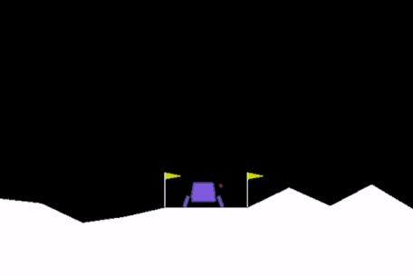
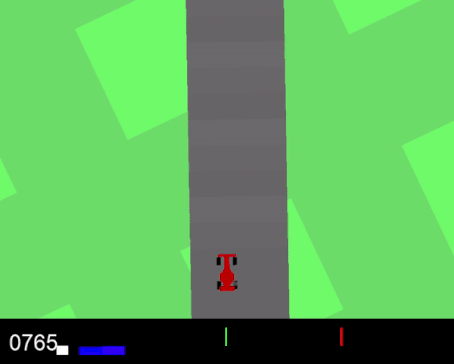

# Td3
My implantation of the td3 and td3-fork algorithms by the papers: https://arxiv.org/pdf/1802.09477.pdf https://arxiv.org/pdf/2010.01652.pdf
This repository includes the codes associated with the td3 algorithm and variations (fork and 2d environment) and implementation for 3 gym environments including:
"Bipedal Walker" "Lunar Lander" and "Car Racing"
# THE RESULTS
### Bipedal Walker
Final Agent

Learning process

https://user-images.githubusercontent.com/72827063/174667536-929dc82d-1711-49ac-9973-d71b37138d3c.mp4

### Lunar Lander
Final Agent

Learning process

https://user-images.githubusercontent.com/72827063/174752040-afa3d440-8e6d-4248-a293-c1622295d125.mp4

TD3-Fork compared to regular TD3 in training ephocs (Fork by the left) nearly 100 epochs difference.

  

### Car Race
Final Agent

Learning process

https://user-images.githubusercontent.com/72827063/177058437-47f7ae0e-bf0c-42ac-857c-0dffdfb16ed3.mp4

Reward by loops

