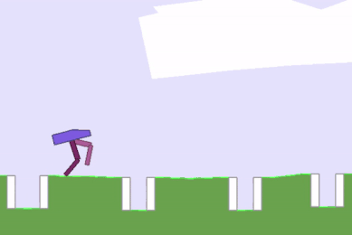

# Td3
My implantation of the td3 and td3-fork algorithms by the papers: https://arxiv.org/pdf/1802.09477.pdf https://arxiv.org/pdf/2010.01652.pdf
This repository includes the codes associated with the td3 algorithm and variations (fork and 2d environment) and implementation for 3 gym environments including:
"Bipedal Walker" "Lunar Lander" and "Car Racing"
# THE RESULTS
#### Bipedal Walker
Final agent

